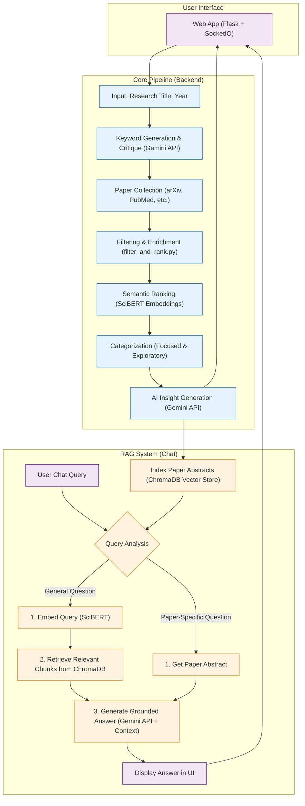

# 📄 Authematic: (Automatic + Thematic)

Authematic is a lightweight, agent-driven assistant designed to streamline academic literature review. It takes a research paper title as input and produces two curated lists of the most relevant academic papers, saving researchers hours of manual searching and filtering.

Beyond simple retrieval, Authematic now features an **interactive RAG (Retrieval-Augmented Generation) chat interface**, allowing you to converse with your research, ask follow-up questions, and extract insights directly from the discovered literature.

**Features:**

1.  **Intelligent Paper Curation**: Produces a "Focused Top 20" list of highly relevant papers and an "Exploratory Top 10" list for broader insights.
2.  **Interactive Web Interface**: A modern, chat-based UI for a seamless user experience.
3.  **Conversational RAG Chat**: Ask questions about the entire collection of found papers and get answers grounded in their content.
4.  **Per-Paper Analysis**: Chat directly with individual papers to dissect their abstracts and findings.
5.  **Multi-Source Retrieval**: Gathers papers from major academic databases like arXiv, Semantic Scholar, and CrossRef.
6.  **Semantic Ranking**: Uses SciBERT embeddings to rank papers based on semantic relevance to your query.
7.  **Customizable Search**: Control for recency by setting a publication year cutoff.

Under the hood, it uses LLM calls (Gemini), academic database APIs, SciBERT embeddings, and heuristic boosting to maximize both precision and coverage.

-----

## ⛓️ Architectural Flow

The diagram below illustrates the system's two main stages. First, the **Core Pipeline** processes the user's title to find and rank papers. Second, the results are indexed into a vector store to power the **RAG Chat System**, which the user interacts with through the web app.



-----

## 📂 Project Structure

```
└── team-Autonominds-2025/
    ├── .env
    ├── api_client_manager.py
    ├── embeddings.py
    ├── extract_insights.py
    ├── filter_and_rank.py
    ├── keyword_critic.py
    ├── paper_collector.py
    ├── README.md
    ├── run_pipeline.py
    ├── vector_store_manager.py
    └── web_app/
        ├── app.py
        ├── requirements.txt
        ├── static/
        │   ├── css/style.css
        │   └── js/main.js
        └── templates/
            ├── base.html
            └── index.html
```

-----

## 🔧 Installation & Setup

Follow these steps to get Authematic running on your local machine.

1.  **Clone the repo**
    ```bash
    git clone https://github.com/GenAIPHBuilders-org/team-Autonominds-2025.git
    cd team-Autonominds-2025
    ```
2.  **Create & activate a Python 3.10+ virtual environment**
    ```bash
    # For macOS / Linux
    python3 -m venv venv
    source venv/bin/activate

    # For Windows
    python -m venv venv
    venv\Scripts\activate
    ```
3.  **Install dependencies**
    The `web_app/requirements.txt` file contains all necessary packages.
    ```bash
    pip install -r web_app/requirements.txt
    ```
4.  **Set up your Gemini API key**
    Create a `.env` file in the project root directory and add your API key:
    ```env
    GEMINI_API_KEY="your_api_key_here"
    ```

-----

## 🚀 Usage

You can interact with Authematic using either the full-featured web interface or the basic command-line script.

### Web Interface (Recommended)

The web interface provides the full, interactive chat experience.

1.  **Start the web application:**
    ```bash
    python web_app/app.py
    ```
2.  **Open your browser** to `http://127.0.0.1:5000/`.
3.  **Interact with the Chatbot:**
      * Enter your research title when prompted (e.g., "My research is on using graph neural networks for traffic prediction").
      * Specify a year cutoff when asked.
      * The agent will show its progress in the chat window. This process can take a few minutes.
4.  **Chat with Your Results:**
      * Once the search is complete, a new tabbed interface will appear.
      * Use the **"General Chat"** tab to ask high-level questions about all the papers found.
      * Click on a specific paper in the **"Focused"** or **"Exploratory"** lists to see its details and chat with its abstract directly.

### Command Line Interface

For a non-interactive, backend-only run, use the `run_pipeline.py` script.

1.  **Run the script:**
    ```bash
    python run_pipeline.py
    ```
2.  **Follow the prompts** to enter your research title and publication year cutoff. The results will be printed to the console.

-----

## 🔍 Troubleshooting

  * `API Key Issues`: Ensure your Gemini API key is correctly set in the `.env` file in the project root.
  * `Model Downloads`: The first run may take longer as it downloads the SciBERT model used for embeddings. Ensure you have an active internet connection.
  * `Missing Directories`: The web app will automatically create required directories if they don't exist.

-----

## ✅ Test Case

```
Research Title: Self-Supervised Learning Approaches for 3D Point Cloud Understanding
Cutoff Year: 2015
```

Upon running the pipeline with the above inputs via the web interface, the system should:

1.  Generate relevant academic topics, subthemes, and refined search keywords.
2.  Fetch and filter papers from academic sources.
3.  Perform semantic ranking and categorize papers into Focused and Exploratory groups.
4.  Generate AI-powered insights for each paper.
5.  **Display a final, interactive tabbed interface**, allowing you to chat with the results and explore individual papers.

-----

## 🤝 Contributing

1.  Fork the repository
2.  Create a feature branch: `git checkout -b feature-name`
3.  Commit your changes: `git commit -m 'Add some feature'`
4.  Push to the branch: `git push origin feature-name`
5.  Open a pull request

-----

## 🤓 Team Members

  * **Vhien Anuta** (Team Representative) - [Github](https://github.com/algo-boy)
  * **Raphael Gio Acupan** (AI Integration Engineer) - [Github](https://github.com/GioAcupan)
  * **Princess Joeby Arabis** (Front-end Developer) - [Github](https://github.com/PrincessA29)
  * **Yuri Alfrance Egipto** (Front-end Developer) - [Github](https://github.com/yurialfrance)
